  
---

---

Future game developer in the making.

**I can't wait for you to play the world I'm creating.**

 

### Stacks
---

 

 

### Contact Me
---

 

### You can also meet them here
---

---

 

  
  

